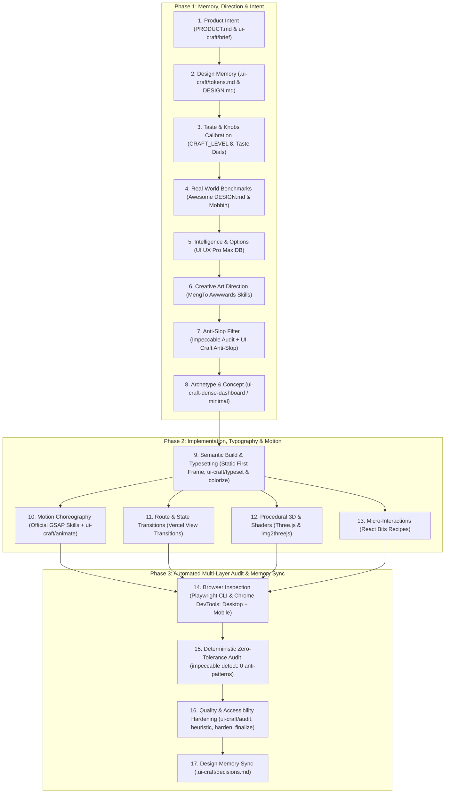

# FinKaif Design Stack & Creative Engineering Master Pipeline

This document is the **authoritative single point of entry** for all UI/UX design, art direction, creative frontend engineering, motion choreography, and automated visual quality audits in FinKaif OS.

---

## 1. Trigger Directives: Протокол «дизайн »

Главный триггер запуска всего стека — ключевое слово **`дизайн `** (например: *`дизайн главной страницы`*, *`дизайн модального окна`*, *`дизайн экрана ассистента`*, *`дизайн карточки цели`*, *`дизайн графиков`*), а также любые прямые задачи на редизайн, визуал, стилизацию или анимации (*"переделай дизайн"*, *"сделай красиво"*, *"сделай круче"*, *"сделай дорогой интерфейс"*).

При получении команды по протоколу **`дизайн `**:
1. **Категорический запрет на слепой код**: НИКОГДА не писать JSX/CSS/HTML сразу.
2. **Строгое следование 16-шаговому конвейеру**: задействовать соответствующие инструменты из 17 интегрированных систем.
3. **Фиксация артефактов**: перед сдачей обязательно прогнать автоматическую проверку через `impeccable detect` и визуальный снапшот через `playwright-cli`.

Следовать **16-шаговому мастер-пайплайну** ниже:

---

## 2. The 16-Step Master Execution Pipeline



---

### Phase 1: Direction & Research (Before Writing Code)

1. **Product Intent & Architecture ([PRODUCT.md](file:///C:/Users/DNS/.gemini/antigravity/scratch/FinKaif-7/PRODUCT.md))**
   - Read the core product purpose, target users, platform constraints, and value proposition.
   - Financial numbers are the hero, not secondary decorative items.
   - Reference: [PRODUCT.md](file:///C:/Users/DNS/.gemini/antigravity/scratch/FinKaif-7/PRODUCT.md) · [AGENTS.md](file:///C:/Users/DNS/.gemini/antigravity/scratch/FinKaif-7/AGENTS.md)

2. **Master Design System Compliance ([DESIGN.md](file:///C:/Users/DNS/.gemini/antigravity/scratch/FinKaif-7/DESIGN.md))**
   - Check FinKaif's established color variables, deep dark surfaces (Velvet Slate & Cashmere Jade), typography scales, spacing tokens, and component definitions.
   - References: [DESIGN.md](file:///C:/Users/DNS/.gemini/antigravity/scratch/FinKaif-7/DESIGN.md) · [DESIGN_SYSTEM.md](file:///C:/Users/DNS/.gemini/antigravity/scratch/FinKaif-7/DESIGN_SYSTEM.md)

3. **Taste Configuration & Dial Calibration ([Taste Skill](file:///C:/Users/DNS/.gemini/antigravity/scratch/FinKaif-7/.agents/skills/taste-skill/SKILL.md))**
   - Calibrate the 3 core frontend taste dials:
     * `DESIGN_VARIANCE: 4` (Disciplined, asymmetric elegance; avoids identical monotonous cards)
     * `MOTION_INTENSITY: 5` (Fluid, physics-grounded micro-motion; zero tacky bounce)
     * `VISUAL_DENSITY: 6` (Modern financial terminal density; high information-to-pixel ratio)
   - Utilize sub-skills: `gpt-tasteskill`, `redesign-skill`, `image-to-code-skill`, `minimalist-skill`, `brandkit`.
   - Reference: [.agents/skills/taste-skill/](file:///C:/Users/DNS/.gemini/antigravity/scratch/FinKaif-7/.agents/skills/taste-skill/)

4. **Curated World-Class Benchmarks ([Awesome DESIGN.md](file:///C:/Users/DNS/.gemini/antigravity/scratch/FinKaif-7/.shared/awesome-design-md/README.md) & Mobbin)**
   - Query curated design specifications from 65+ top products:
     * Fintech: Revolut, Stripe, Wise, Coinbase, Binance
     * Modern SaaS: Linear, Apple, Figma, Framer, Cursor, Claude, ElevenLabs
   - Search real-world screens via Mobbin MCP (`mobbin_search_screens`, `mobbin_search_apps`).
   - Location: `.shared/awesome-design-md/upstream/voltagent-awesome-design-md/design-md/`
   - Skill: [.agents/skills/awesome-design-md/SKILL.md](file:///C:/Users/DNS/.gemini/antigravity/scratch/FinKaif-7/.agents/skills/awesome-design-md/SKILL.md)

5. **Design Intelligence & Options ([UI UX Pro Max](file:///C:/Users/DNS/.gemini/antigravity/scratch/FinKaif-7/.agents/skills/ui-ux-pro-max/SKILL.md))**
   - Query styles, color contrast pairings, typography pairings, and chart types.
   - Run: `node .shared/ui-ux-pro-max/scripts/search.cjs "<keyword>" --domain <product|style|typography|color|chart|ux>`
   - Rule: Do NOT default to the first output. Use as a multi-dimensional matrix of options.
   - Reference: [UI UX Pro Max Skill](file:///C:/Users/DNS/.gemini/antigravity/scratch/FinKaif-7/.agents/skills/ui-ux-pro-max/SKILL.md)

6. **Creative Direction & Awwwards Patterns ([MengTo Creative](file:///C:/Users/DNS/.gemini/antigravity/scratch/FinKaif-7/.agents/skills/mengto-creative/SKILL.md))**
   - Elevate the screen above standard SaaS patterns with distinctive visual art direction.
   - Selected Skills:
     * [Build Awwwards-Quality Sites](file:///C:/Users/DNS/.gemini/antigravity/scratch/FinKaif-7/.agents/skills/mengto-creative/build-awwwards-quality-sites/SKILL.md)
     * [Cinematic Scroll Storytelling](file:///C:/Users/DNS/.gemini/antigravity/scratch/FinKaif-7/.agents/skills/mengto-creative/cinematic-scroll-storytelling/SKILL.md)
     * [Cinematic GSAP + Lenis Motion](file:///C:/Users/DNS/.gemini/antigravity/scratch/FinKaif-7/.agents/skills/mengto-creative/cinematic-gsap-lenis-motion-system/SKILL.md)
     * [Masked Reveal](file:///C:/Users/DNS/.gemini/antigravity/scratch/FinKaif-7/.agents/skills/mengto-creative/masked-reveal/SKILL.md)
     * [Progressive Blur](file:///C:/Users/DNS/.gemini/antigravity/scratch/FinKaif-7/.agents/skills/mengto-creative/progressive-blur/SKILL.md)
     * [Liquid Metal Border](file:///C:/Users/DNS/.gemini/antigravity/scratch/FinKaif-7/.agents/skills/mengto-creative/liquid-metal-border/SKILL.md)

7. **Anti-Slop Filter & Pre-Flight Review ([Impeccable](file:///C:/Users/DNS/.gemini/antigravity/scratch/FinKaif-7/.agents/skills/impeccable/SKILL.md) + [UI/UX Kit](file:///C:/Users/DNS/.gemini/antigravity/scratch/FinKaif-7/.agents/skills/ui-ux-kit/SKILL.md))**
   - Strict sanity check to eliminate cliché AI tropes.
   - Run: `impeccable audit` or review against 61 deterministic rules.
   - Anti-Pattern Checklist:
     - ❌ No generic "sidebar + topbar + 4 KPI cards" layout.
     - ❌ No repetitive Bento Grid for everything.
     - ❌ No purple/blue AI gradient blobs.
     - ❌ No ungrounded glassmorphism everywhere.
     - ❌ No side-tab colored card stripes (`.card::before` border trick).
     - ❌ No generic icon + heading + paragraph 3-column rows.
     - ❌ No decorative 3D spheres without financial purpose.
   - References:
     * [Impeccable Skill](file:///C:/Users/DNS/.gemini/antigravity/scratch/FinKaif-7/.agents/skills/impeccable/SKILL.md)
     * [UI/UX Kit Quality Floor](file:///C:/Users/DNS/.gemini/antigravity/scratch/FinKaif-7/.agents/skills/ui-ux-kit/SKILL.md)
     * [Anthropic Frontend Design](file:///C:/Users/DNS/.gemini/antigravity/scratch/FinKaif-7/.agents/skills/frontend-design/SKILL.md)

8. **Concrete Concept & Signature Selection**
   - Formulate a clear, intentional thesis: 1 strong focal asset, 1-2 distinct interaction techniques, and disciplined typography.

---

### Phase 2: Implementation & Motion (Engineering Phase)

9. **Semantic & Responsive Markup (Static First Frame)**
   - Static first frame: page must look complete, polished, and readable before JavaScript, WebGL, or animations load.
   - Strict touch and responsive mobile adaptations.

10. **Motion Choreography ([Official GSAP Skills](file:///C:/Users/DNS/.gemini/antigravity/scratch/FinKaif-7/.agents/skills/gsap-skills/SKILL.md))**
    - **Precedence Rule**: Official GSAP guidelines strictly override any conflicting third-party recommendations.
    - Rules:
      * Wrap in `gsap.context()` or `useGSAP()` with automatic cleanup.
      * Animate only composite properties (`xPercent`, `yPercent`, `x`, `y`, `scale`, `opacity`, `rotation`). NEVER animate `width`, `height`, `top`, `left`, `margin`, `padding`.
      * Refresh `ScrollTrigger` when fonts, images, or DOM measurements change.
    - References:
      * [Official GSAP Master](file:///C:/Users/DNS/.gemini/antigravity/scratch/FinKaif-7/.agents/skills/gsap-skills/SKILL.md)
      * [GSAP Core](file:///C:/Users/DNS/.gemini/antigravity/scratch/FinKaif-7/.agents/skills/gsap-skills/skills/gsap-core/SKILL.md)
      * [GSAP ScrollTrigger](file:///C:/Users/DNS/.gemini/antigravity/scratch/FinKaif-7/.agents/skills/gsap-skills/skills/gsap-scrolltrigger/SKILL.md)
      * [GSAP Performance](file:///C:/Users/DNS/.gemini/antigravity/scratch/FinKaif-7/.agents/skills/gsap-skills/skills/gsap-performance/SKILL.md)

11. **Page & Route Transitions ([Vercel View Transitions](file:///C:/Users/DNS/.gemini/antigravity/scratch/FinKaif-7/.agents/skills/vercel-agent-skills/SKILL.md))**
    - Separate concerns:
      * **View Transitions** handle route/page changes and card-to-detail expansion (`document.startViewTransition`).
      * **GSAP** handles internal choreography and scrubbed timelines.
      * NEVER animate the same element simultaneously with both systems.
    - References: [Vercel View Transitions Guide](file:///C:/Users/DNS/.gemini/antigravity/scratch/FinKaif-7/.agents/skills/vercel-agent-skills/skills/react-view-transitions/SKILL.md)

12. **Procedural 3D Models & Shaders ([Three.js](file:///C:/Users/DNS/.gemini/antigravity/scratch/FinKaif-7/.agents/skills/mengto-creative/threejs/SKILL.md) & [img2threejs](file:///C:/Users/DNS/.gemini/antigravity/scratch/FinKaif-7/.agents/skills/img2threejs/SKILL.md))**
    - Use procedural Three.js reconstruction from reference images (`img2threejs`) to build code-only models (`THREE.Group`) with custom shaders, physically-grounded materials, and zero heavy asset bloat.
    - Safeguards: cap DPR at 1.5, pause rendering when offscreen or blurred, dispose geometries, materials, and textures on unmount.
    - References:
      * [img2threejs Skill](file:///C:/Users/DNS/.gemini/antigravity/scratch/FinKaif-7/.agents/skills/img2threejs/SKILL.md)
      * [Three.js Guide](file:///C:/Users/DNS/.gemini/antigravity/scratch/FinKaif-7/.agents/skills/mengto-creative/threejs/SKILL.md)

13. **Micro-Interactions & Component Recipes ([React Bits](file:///C:/Users/DNS/.gemini/antigravity/scratch/FinKaif-7/.agents/skills/react-bits/SKILL.md))**
    - Pick individual recipes from the local catalog without bloating the bundle.
    - Adapt all colors, typography, borders, and radiuses to FinKaif's Velvet Slate & Cashmere Jade palette.
     - Component Library: Text animations, Background shaders (Aurora, Beams), Spotlight cards, and interactive docks.
     - Reference: [React Bits Master Skill](file:///C:/Users/DNS/.gemini/antigravity/scratch/FinKaif-7/.agents/skills/react-bits/SKILL.md)

---

### Phase 3: Automated Audit & Polish (Before Handoff)

14. **Token-Efficient Browser Automation ([Playwright CLI](file:///C:/Users/DNS/.gemini/antigravity/scratch/FinKaif-7/.agents/skills/playwright-cli/SKILL.md) & [Chrome DevTools MCP](file:///C:/Users/DNS/.gemini/antigravity/mcp/chrome-devtools/instructions.md))**
    - Run headless visual inspections via Playwright CLI:
      * `playwright-cli open <url>`
      * `playwright-cli snapshot` (compact element tree with refs)
      * `playwright-cli screenshot [target]`
      * `playwright-cli resize <w> <h>` (test mobile 390x844 and desktop 1440x900)
    - Check console messages, performance traces, and network requests via Chrome DevTools MCP.
    - Reference: [.agents/skills/playwright-cli/](file:///C:/Users/DNS/.gemini/antigravity/scratch/FinKaif-7/.agents/skills/playwright-cli/)

15. **Deterministic Anti-Slop & Polish Commands ([Impeccable](file:///C:/Users/DNS/.gemini/antigravity/scratch/FinKaif-7/.agents/skills/impeccable/SKILL.md))**
    - Run deterministic code detection:
      ```bash
      impeccable detect public/style.css public/index.html
      ```
    - Apply specialized Impeccable review, audit, critique, and polish commands:
      * `impeccable audit` — Technical quality check across A11y, Performance, Theming, Responsive, and Anti-patterns.
      * `impeccable critique` — Two isolated sub-agents: Assessment A (Design Director review) + Assessment B (Detector & Browser evidence).
      * `impeccable polish` — Surgical typographic, spacing rhythm, micro-contrast, and state polish without redesign.
      * `impeccable animate` — Motion thesis, purposeful physics-grounded transitions, feedback, and continuity.
      * `impeccable overdrive` — Pushing signature interactions past conventional limits (3 directions proposal first!).
      * `impeccable delight` — Humane touches, celebration at milestones, and meaningful feedback.
      * `impeccable adapt` — Rethinking the experience across viewports and touch targets.
      * `impeccable optimize` — Diagnosing and eliminating UI bottlenecks (CWV, layout thrashing, image payloads).
      * `impeccable live` — Interactive browser variant mode with dev server hot reload.
    - Reference: [.agents/skills/impeccable/SKILL.md](file:///C:/Users/DNS/.gemini/antigravity/scratch/FinKaif-7/.agents/skills/impeccable/SKILL.md)

16. **Final Quality & Accessibility Gate ([Vercel Web Interface Guidelines](file:///C:/Users/DNS/.gemini/antigravity/scratch/FinKaif-7/.agents/skills/web-interface-guidelines/SKILL.md))**
    - Rigorous checklist for production quality:
      * Keyboard navigation and visible focus rings.
      * Contrast ratios (minimum 4.5:1 for body copy).
      * Touch targets (minimum 44x44px on mobile).
      * Form inputs with proper autocomplete, inputmode, and error states.
      * Respect `prefers-reduced-motion: reduce`.
    - Reference: [Web Interface Guidelines](file:///C:/Users/DNS/.gemini/antigravity/scratch/FinKaif-7/.agents/skills/web-interface-guidelines/SKILL.md)

---

## 3. Impeccable Capability Matrix & Integration

Impeccable is integrated as a permanent core engine throughout the entire design lifecycle: from early pre-flight shaping and brief definition, through creative overdrive and motion, to automated browser audits, critique, and surgical polish.

### Compact Capabilities Table

| Capability | When to Apply | Required Tools | Limitations & Constraints |
|:---|:---|:---|:---|
| **`craft`** | Creating new UI surfaces or features from a blank slate. | `impeccable` CLI, `PRODUCT.md`, `DESIGN.md` | **Deprecated alias** for `new-work` (routes through `init` + `new-work`). Does not replace discovery interview (`shape`). |
| **`shape`** | **BEFORE writing code**. Discovering user intent, constraints, inputs/outputs, edge cases, and architectural scope. | Impeccable discovery prompt, structured question tool (`ask_question`). | Diagnostic & planning only; outputs a confirmed design brief, not executable CSS/HTML. |
| **`critique`** | Comprehensive UX design evaluation; assessing visual hierarchy, information architecture, cognitive load, and anti-patterns. | **2 isolated sub-agents** (Assessment A: design review; Assessment B: detector/browser evidence), `impeccable detect`, Headless Browser (`playwright-cli` / Chrome DevTools). | Evaluation only (does not mutate code directly). Running without isolated sub-agents requires explicit `⚠️ DEGRADED` banner. |
| **`audit`** | Systematic code-level technical quality checks across 5 pillars: Accessibility (A11y), Performance, Theming, Responsive, and Anti-patterns. | `impeccable detect`, code inspection, Headless Browser (`playwright-cli` / Chrome DevTools) for DOM verification. | Code-level technical check, does not judge brand tone or copy. Documents issues rather than automatically fixing them. |
| **`animate`** | Adding purposeful motion, micro-interactions, state transitions, spatial continuity, or focus cues to a static UI. | CSS, GSAP (`gsap-skills`), Browser preview (`playwright-cli`). | Strictly bans decorative animation debt. Requires GPU-only properties (`transform`, `opacity`) and mandatory `prefers-reduced-motion` compliance. |
| **`overdrive`** | Pushing interfaces past conventional limits with ambitious, showcase-caliber visual effects, advanced shaders, canvas/WebGL, liquid physics, or high-fps virtualization. | 3D/Shader engines (`Three.js`, `img2threejs`), Canvas, CSS View Transitions, Browser Automation (`playwright-cli`), Media generators (`generate_image`). | **High risk of misfire**. MUST propose 2–3 directions first and get user confirmation before writing code. Requires active browser visual verification. |
| **`delight`** | Adding moments of personality, warmth, and memorable touches at meaningful milestones (success states, empty states, loading, recovery, discovery). | Code editor, micro-interaction recipes (`react-bits`), audio/haptics/illustrations if applicable. | Cannot be sprayed everywhere. Never trivializes financial loss, errors, or sensitive actions. Must remain satisfying after 100 uses. |
| **`polish`** | **Final pre-flight quality pass before shipping**. Surgical alignment, spacing rhythm, micro-contrast, typography, and state completeness. | `impeccable detect`, `DESIGN.md` tokens, `playwright-cli` for multi-viewport inspection (desktop & mobile). | Strictly refinement, **NEVER disguised redesign**. Preserves existing layout, business logic, and copy. |
| **`optimize`** | Diagnosing and eliminating UI bottlenecks: slow initial load, layout thrashing, high CLS/INP/LCP, massive asset payloads, or frame drops. | Chrome DevTools MCP (`performance_start_trace`, `lighthouse_audit`, `list_network_requests`), code profiler, image compression tools. | Measure before and after. Banned from premature optimization of non-bottleneck components. |
| **`adapt`** | Adapting an interface across device viewports (desktop, tablet, mobile), touch vs pointer input, or orientation contexts. | Headless Browser (`playwright-cli resize 390 844` / Chrome DevTools `emulate`), CSS Media Queries / Container Queries. | Not just CSS scaling; requires rethinking the experience (e.g., bottom navigation, 44x44px touch targets, zero horizontal scroll, tap feedback). |
| **`document`** | Generating or synchronizing canonical `DESIGN.md` specifications from codebase tokens, CSS variables, and design patterns. | `impeccable` CLI / scripts, AST token extraction. | Captures existing codebase truth; does not invent new design tokens out of thin air without user guidance. |
| **`live`** | Interactive live variant exploration in the browser; selecting elements on screen, selecting a direction, and hot-reloading variants in real time. | Running dev server with HMR (`http://localhost:3015`), interactive browser session (`live-browser.js`), poll loop script. | Local dev server only (unsupported on external HTTPS production builds). Requires active polling background process. |

### Special Tooling Dependencies
- **External CLI / Scripts**: In Windows PowerShell, run via `& "C:\Users\DNS\AppData\Roaming\Antigravity\bin\impeccable.exe"` or `.agents/skills/impeccable/scripts/impeccable.cmd`.
- **Media Generators (`generate_image`)**: When designing Persuade or Experience surfaces requiring rich visual imagery, photorealistic hero backgrounds, or custom textures, use `generate_image` as Impeccable specifies asset needs but does not synthesize binary imagery directly.
- **Headless Browser Access (`playwright-cli` / Chrome DevTools MCP)**: Essential for `live` variant mode, `critique` visual evaluation, `audit` DOM inspection, `adapt` mobile viewport checks (390x844), and `overdrive` visual iteration.

### Precedence Hierarchy
> [!IMPORTANT]
> **User Instructions & Project Design System Take Strict Precedence**: If any recommendation from Impeccable conflicts with explicit user preferences or FinKaif's established design system in [DESIGN.md](file:///C:/Users/DNS/.gemini/antigravity/scratch/FinKaif-7/DESIGN.md) (Velvet Slate `#080D0B`, Midnight Emerald `#111A16`, Cashmere Jade `#10B981` / `#34D399`, tabular figures, editorial typography), **the project design system and user instructions strictly override Impeccable**.

---

## 4. Complete Design Stack Tool Registry

| # | Tool / Resource | Category | Location / Command | Primary Purpose |
|---|---|---|---|---|
| 1 | **Taste Skill** | Workspace Skill | `.agents/skills/taste-skill/` (alias `design-taste-frontend`) | Anti-slop frontend taste layer, dials: VARIANCE, MOTION, DENSITY |
| 2 | **Impeccable** | CLI & Skill Engine | `.agents/skills/impeccable/` (`impeccable`) | 24 review/polish commands, 61 anti-slop rules, PRODUCT/DESIGN.md integration |
| 3 | **Playwright CLI** | CLI & Skill Suite | `.agents/skills/playwright-cli/` (`playwright-cli`) | Token-efficient browser automation, snapshots, screenshots, testing |
| 4 | **Awesome DESIGN.md** | Reference Library | `.shared/awesome-design-md/` + `.agents/skills/awesome-design-md/` | 65+ real-world design systems (Revolut, Stripe, Linear, Wise, Apple) |
| 5 | **img2threejs** | Workspace Skill & Forge | `.agents/skills/img2threejs/` | Image-to-procedural Three.js code reconstruction, materials, shaders |
| 6 | **MengTo Creative Web** | Workspace Skill | `.agents/skills/mengto-creative/` | Awwwards art direction, cinematic motion, Lenis, WebGL |
| 7 | **Official GSAP Skills** | Workspace Skill | `.agents/skills/gsap-skills/` | Authoritative animation rules, timeline choreography, ScrollTrigger |
| 8 | **UI UX Pro Max** | Workspace Skill + DB | `.agents/skills/ui-ux-pro-max/` + `.shared/` | 79 styles, 21 palettes, 50 typography pairings, charts, CLI search |
| 9 | **UI/UX Kit** | Workspace Skill | `.agents/skills/ui-ux-kit/` | Anti-AI-slop rules, surface rules, quality floor |
| 10 | **Anthropic Frontend Design** | Workspace Skill | `.agents/skills/frontend-design/` | Quality verification, design heuristics, typography courage |
| 11 | **Vercel Agent Skills** | Workspace Skill | `.agents/skills/vercel-agent-skills/` | React View Transitions, state & route transitions, composition |
| 12 | **React Bits** | Workspace Skill + Recipes | `.agents/skills/react-bits/` | Curated micro-interactions, text effects, shaders, interactive cards |
| 13 | **Vercel Web Guidelines** | Workspace Skill | `.agents/skills/web-interface-guidelines/` | Accessibility, responsive behavior, interaction polish |
| 14 | **Mobbin MCP** | MCP Server | Configured (`https://api.mobbin.com/mcp`) | 600k+ real-world UI screens research |
| 15 | **Figma MCP** | MCP Server | Registered in Antigravity | Inspect design files, tokens, styles |
| 16 | **21st-dev MCP** | MCP Server | Registered in Antigravity | Inspiration, component catalog search |
| 17 | **Chrome DevTools MCP**| MCP Server | Registered in Antigravity | Visual screenshot inspection, console check, mobile emulation |
| 18 | **UI-Craft (29 Skills)** | Suite & MCP | `~/.gemini/skills/` (`ui-craft`, `craft`, `tokens`, etc.) | Anti-slop engineering, archetypes, typography, color budget, memory |
