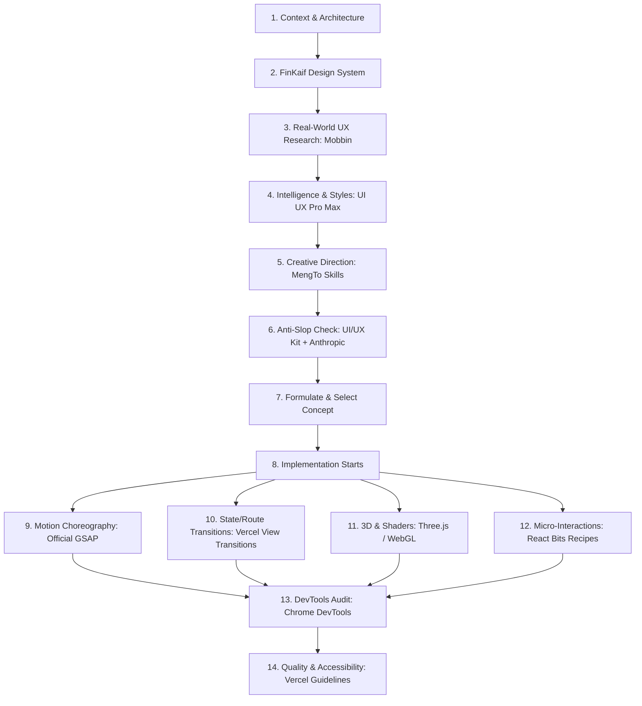

# FinKaif Design Stack & Creative Engineering Master Pipeline

This document is the **single point of entry** for all UI/UX design, art direction, creative frontend engineering, motion choreography, and quality audits in FinKaif OS.

---

## 1. Trigger Directives

Whenever a task involves designing, redesigning, styling, animating, or building interfaces (e.g. *"сделай страницу"*, *"переделай дизайн"*, *"сделай красиво"*, *"сделай круче"*, *"сделай нестандартно"*, *"сделай дорогой сайт"*, *"добавь анимации"*, *"сделай переход"*, *"переделай главный экран"*), **DO NOT jump straight into writing JSX/CSS**.

Follow the **14-Step Execution Pipeline** below. Select only the skills relevant to the task without overloading context.

---

## 2. The 14-Step Execution Pipeline

### Phase 1: Research & Conception (Before Writing Code)

1. **Project Context & Financial Goal**
   - Understand the primary user task and financial information architecture.
   - Financial numbers are the hero, not secondary decorative items.
   - Reference: [AGENTS.md](file:///C:/Users/DNS/.gemini/antigravity/scratch/FinKaif-7/AGENTS.md)

2. **Existing Design System Compliance**
   - Align with FinKaif's established color variables, deep dark surfaces, emerald/gold accents, typography scales, and component tokens.
   - Reference: [DESIGN_SYSTEM.md](file:///C:/Users/DNS/.gemini/antigravity/scratch/FinKaif-7/DESIGN_SYSTEM.md)

3. **Real-World UX Benchmark (Mobbin MCP)**
   - Research high-end fintech solutions (Revolut, Wise, Stripe, Linear, Apple Card).
   - Tool: `mobbin_search_screens`, `mobbin_search_apps`, `mobbin_search_flows`
   - Reference: [Mobbin Instructions](file:///C:/Users/DNS/.gemini/antigravity/mcp/mobbin/instructions.md)

4. **Design Intelligence & Options (UI UX Pro Max)**
   - Query styles, color contrast pairings, typography pairings, and chart types.
   - Run: `node .shared/ui-ux-pro-max/scripts/search.cjs "<keyword>" --domain <product|style|typography|color|chart|ux>`
   - Rule: Do NOT default to the first output. Use as a matrix of options.
   - Reference: [UI UX Pro Max Skill](file:///C:/Users/DNS/.gemini/antigravity/scratch/FinKaif-7/.agents/skills/ui-ux-pro-max/SKILL.md)

5. **Creative Direction & Awwwards Patterns (MengTo Skills)**
   - Elevate the screen above standard SaaS patterns with distinctive visual art direction.
   - Selected Skills:
     * [Build Awwwards-Quality Sites](file:///C:/Users/DNS/.gemini/antigravity/scratch/FinKaif-7/.agents/skills/mengto-creative/build-awwwards-quality-sites/SKILL.md)
     * [Cinematic Scroll Storytelling](file:///C:/Users/DNS/.gemini/antigravity/scratch/FinKaif-7/.agents/skills/mengto-creative/cinematic-scroll-storytelling/SKILL.md)
     * [Cinematic GSAP + Lenis Motion](file:///C:/Users/DNS/.gemini/antigravity/scratch/FinKaif-7/.agents/skills/mengto-creative/cinematic-gsap-lenis-motion-system/SKILL.md)
     * [Animation Systems](file:///C:/Users/DNS/.gemini/antigravity/scratch/FinKaif-7/.agents/skills/mengto-creative/animation-systems/SKILL.md)
     * [Masked Reveal](file:///C:/Users/DNS/.gemini/antigravity/scratch/FinKaif-7/.agents/skills/mengto-creative/masked-reveal/SKILL.md)
     * [Progressive Blur](file:///C:/Users/DNS/.gemini/antigravity/scratch/FinKaif-7/.agents/skills/mengto-creative/progressive-blur/SKILL.md)
     * [Liquid Metal Border](file:///C:/Users/DNS/.gemini/antigravity/scratch/FinKaif-7/.agents/skills/mengto-creative/liquid-metal-border/SKILL.md)

6. **Anti-AI-Slop & Quality Floor Filter (UI/UX Kit + Anthropic)**
   - Strict sanity check to eliminate cliché AI tropes.
   - Anti-Pattern Checklist:
     - ❌ No generic "sidebar + topbar + 4 KPI cards" layout.
     - ❌ No repetitive Bento Grid for everything.
     - ❌ No generic purple/blue AI gradient blobs.
     - ❌ No ungrounded glassmorphism everywhere.
     - ❌ No generic icon + heading + paragraph 3-column rows.
     - ❌ No decorative 3D spheres without financial purpose.
   - References:
     * [UI/UX Kit Quality Floor](file:///C:/Users/DNS/.gemini/antigravity/scratch/FinKaif-7/.agents/skills/ui-ux-kit/SKILL.md)
     * [Anthropic Frontend Design](file:///C:/Users/DNS/.gemini/antigravity/scratch/FinKaif-7/.agents/skills/frontend-design/SKILL.md)

7. **Concrete Concept Selection**
   - Formulate a clear, intentional thesis: 1 strong focal asset, 1-2 distinct interaction techniques, and disciplined typography.

---

### Phase 2: Implementation (Engineering & Motion)

8. **Semantic & Responsive Markup**
   - Static first frame: page must look complete, polished, and readable before JavaScript, WebGL, or animations load.
   - Strict touch and responsive mobile adaptations.

9. **Motion Choreography (Official GSAP Skills)**
   - **Precedence Rule**: Official GSAP guidelines strictly override any conflicting third-party recommendations.
   - Rules:
     * Use `@gsap/react` `useGSAP()` or wrap in `gsap.context()` with automatic cleanup.
     * Animate only composite properties (`xPercent`, `yPercent`, `x`, `y`, `scale`, `opacity`, `rotation`). NEVER animate `width`, `height`, `top`, `left`, `margin`, `padding`.
     * Refresh `ScrollTrigger` when fonts, images, or DOM measurements change.
   - References:
     * [Official GSAP Master](file:///C:/Users/DNS/.gemini/antigravity/scratch/FinKaif-7/.agents/skills/gsap-skills/SKILL.md)
     * [GSAP Core](file:///C:/Users/DNS/.gemini/antigravity/scratch/FinKaif-7/.agents/skills/gsap-skills/skills/gsap-core/SKILL.md)
     * [GSAP ScrollTrigger](file:///C:/Users/DNS/.gemini/antigravity/scratch/FinKaif-7/.agents/skills/gsap-skills/skills/gsap-scrolltrigger/SKILL.md)
     * [GSAP React Integration](file:///C:/Users/DNS/.gemini/antigravity/scratch/FinKaif-7/.agents/skills/gsap-skills/skills/gsap-react/SKILL.md)
     * [GSAP Performance](file:///C:/Users/DNS/.gemini/antigravity/scratch/FinKaif-7/.agents/skills/gsap-skills/skills/gsap-performance/SKILL.md)

10. **Page & Route Transitions (Vercel View Transitions)**
    - Separate concerns:
      * **View Transitions** handle route/page changes and card-to-detail expansion (`document.startViewTransition` / React 19 View Transitions).
      * **GSAP** handles internal choreography and scrubbed timelines.
      * NEVER animate the same element simultaneously with both systems.
    - References:
      * [Vercel View Transitions Guide](file:///C:/Users/DNS/.gemini/antigravity/scratch/FinKaif-7/.agents/skills/vercel-agent-skills/skills/react-view-transitions/SKILL.md)
      * [CSS Recipes](file:///C:/Users/DNS/.gemini/antigravity/scratch/FinKaif-7/.agents/skills/vercel-agent-skills/skills/react-view-transitions/references/css-recipes.md)
      * [Implementation Patterns](file:///C:/Users/DNS/.gemini/antigravity/scratch/FinKaif-7/.agents/skills/vercel-agent-skills/skills/react-view-transitions/references/patterns.md)

11. **Subordinate 3D & Shaders (Three.js / WebGL)**
    - Only add 3D or shaders when spatial depth or physics materially improves financial comprehension or premium feeling.
    - Strict safeguards: cap DPR at 1.5, pause rendering when offscreen or blurred, dispose geometries, materials, and textures on unmount.
    - References:
      * [Three.js Guide](file:///C:/Users/DNS/.gemini/antigravity/scratch/FinKaif-7/.agents/skills/mengto-creative/threejs/SKILL.md)
      * [WebGL Landing Steering](file:///C:/Users/DNS/.gemini/antigravity/scratch/FinKaif-7/.agents/skills/mengto-creative/webgl-landing-steering/SKILL.md)

12. **Micro-Interactions & Component Recipes (React Bits)**
    - Pick individual recipes from the local catalog without bloating the bundle.
    - Adapt all colors, typography, borders, and radiuses to FinKaif's palette.
    - Component Library:
      * Text: [SplitText, BlurText, ShinyText, DecryptedText, TrueFocus, CountUp](file:///C:/Users/DNS/.gemini/antigravity/scratch/FinKaif-7/.agents/skills/react-bits/components/TextAnimations/)
      * Backgrounds: [Aurora, Hyperspeed, Iridescence, Beams, LetterGlitch, LightRays, Particles, Waves](file:///C:/Users/DNS/.gemini/antigravity/scratch/FinKaif-7/.agents/skills/react-bits/components/Backgrounds/)
      * Micro: [ClickSpark, BlobCursor, FollowCursor, Magnet, SplashCursor, StarBorder](file:///C:/Users/DNS/.gemini/antigravity/scratch/FinKaif-7/.agents/skills/react-bits/components/Animations/)
      * Components: [SpotlightCard, PixelCard, TiltedCard, Dock, CircularGallery, ElasticSlider, Stack](file:///C:/Users/DNS/.gemini/antigravity/scratch/FinKaif-7/.agents/skills/react-bits/components/Components/)
    - References: [React Bits Master Skill](file:///C:/Users/DNS/.gemini/antigravity/scratch/FinKaif-7/.agents/skills/react-bits/SKILL.md)

---

### Phase 3: Verification & Auditing (Before Handoff)

13. **Runtime & Visual Inspection (Chrome DevTools MCP)**
    - Emulate mobile viewports (iPhone 14 Pro, Pixel 7) and desktop resolutions (1440x900, 1920x1080).
    - Capture screenshots, check console errors, verify frame rates and layout shifts.
    - Tools: `take_screenshot`, `emulate`, `resize_page`, `list_console_messages`, `evaluate_script`.

14. **Final Interface Quality Audit (Vercel Web Interface Guidelines)**
    - Rigorous checklist for production quality:
      * Keyboard navigation and visible focus rings.
      * Contrast ratios (minimum 4.5:1 for body copy).
      * Touch targets (minimum 44x44px on mobile).
      * Form inputs with proper autocomplete, inputmode, and error states.
      * Respect `prefers-reduced-motion: reduce`.
    - Reference: [Web Interface Guidelines](file:///C:/Users/DNS/.gemini/antigravity/scratch/FinKaif-7/.agents/skills/web-interface-guidelines/SKILL.md)

---

## 3. Tool & MCP Registry Summary

| Tool / Resource | Category | Location / Status | Primary Purpose |
|---|---|---|---|
| **MengTo Creative Web** | Workspace Skill | `.agents/skills/mengto-creative/` | Awwwards art direction, cinematic motion, WebGL, shaders |
| **Official GSAP Skills** | Workspace Skill | `.agents/skills/gsap-skills/` | Authoritative animation rules, timeline choreography, ScrollTrigger |
| **UI UX Pro Max** | Workspace Skill + DB | `.agents/skills/ui-ux-pro-max/` + `.shared/` | 79 styles, 21 palettes, 50 typography pairings, charts, CLI search |
| **Vercel Agent Skills** | Workspace Skill | `.agents/skills/vercel-agent-skills/` | React View Transitions, state & route transitions, composition |
| **React Bits** | Workspace Skill + Recipes | `.agents/skills/react-bits/` | Curated micro-interactions, text effects, shaders, interactive cards |
| **UI/UX Kit** | Workspace Skill | `.agents/skills/ui-ux-kit/` | Anti-AI-slop rules, surface rules, quality floor |
| **Anthropic Frontend Design** | Workspace Skill | `.agents/skills/frontend-design/` | Quality verification, design heuristics |
| **Vercel Web Guidelines** | Workspace Skill | `.agents/skills/web-interface-guidelines/` | Accessibility, responsive behavior, interaction polish |
| **Mobbin MCP** | MCP Server | Configured (`https://api.mobbin.com/mcp`) | 600k+ real-world UI screens research (requires paid plan OAuth) |
| **Figma MCP** | MCP Server | Registered in Antigravity | Inspect design files, tokens, styles |
| **21st-dev MCP** | MCP Server | Registered in Antigravity | Inspiration, component catalog search |
| **Chrome DevTools MCP**| MCP Server | Registered in Antigravity | Visual screenshot inspection, console check, mobile emulation |
